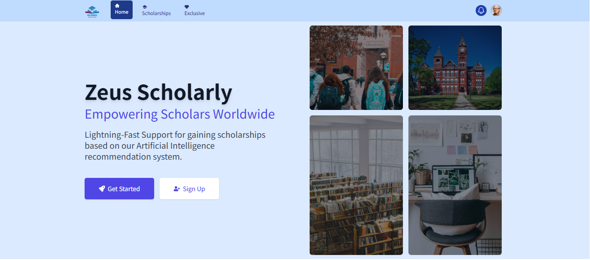
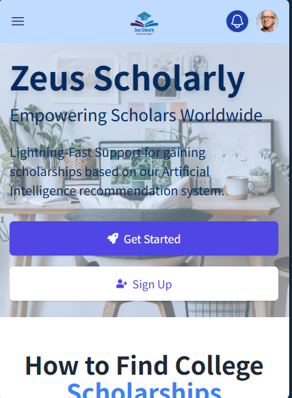

# Zeus Scholarly

Welcome to Zeus Scholarly, a comprehensive platform designed to help students find scholarship opportunities worldwide. This project aims to solve the problem of students struggling to locate scholarship opportunities by aggregating data from various sources and sending notifications via text messages using Twilio.

## Preview

### Desktop View



### Mobile View


## Deployed Site

You can visit the deployed site here: [Zeus Scholarly Live Site](#https://zeus-scholarly.onrender.com/)

## Final Project Blog Article

Read more about the development process and challenges faced during the creation of Zeus Scholarly in our blog post: [Zeus Scholarly Development Blog](#your-blog-article-url)

## Authors

- **Okoye Emmanuel Obiajulu** - [LinkedIn](#https://www.linkedin.com/in/emmanuel-okoye-79a387200/
)
## Features

- **Scholarship Search**: Easily search for scholarships based on criteria like level of study, field of interest, and location.
- **Notifications**: Get notifications via text messages when new scholarships matching your criteria are found.
- **User Profiles**: Create and manage user profiles to save your search preferences and track your applications.
- **Data Aggregation**: Uses web scraping and APIs to gather data from various scholarship sources.

## Technologies Used

- **Frontend**: React, Tailwind CSS, React Icons
- **Backend**: Flask - [View Backend Repository](https://github.com/Obiajulu-gif/Zeus-Scholarly-backend)
- **Database**: Firebase Realtime Database
- **APIs**: Google SERP API

## Project Structure

Zeus-Scholarly/  
│  
├── client/ # React frontend  
│ ├── public/ # Public assets  
│ ├── src/ # Source code  
│ └── package.json # npm configuration file  
│  
├── server/ # Flask backend  
│ ├── app/ # Application code  
│ └── requirements.txt # Python dependencies  
│  
└── README.md # Project README file

## Getting Started

### Prerequisites

- Node.js
- Python 3.7+
- Firebase account

### Installation

1. **Clone the repository:**
   ```bash
   git clone https://github.com/Obiajulu-gif/Zeus-Scholarly.git
   cd Zeus-Scholarly
   ```
2. **Set up the frontend:**
   ```bash
   cd client
   npm install
   ```
3. **Set up the backend:**
   ```bash
   cd ../server
   python -m venv venv
   source venv/bin/activate
   pip install -r requirements.txt
   ```
4. **Configure environment variables:**  
   Create a .env file in the Client directory and add your configuration:
   ```bash
   VITE_FIREBASE_API_KEY=ADD_YOUR_KEY
   VITE_APPID=ADD_YOUR_KEY
   VITE_MESSAGINGSENDERID=ADD_YOUR_KEY
   VITE_MEASUREMENTID=ADD_YOUR_KEY
   ```
   Create a .env file in the Server directory and add your configuration:
   ```bash
   API_KEY=ADD_YOUR_KEY
   api_key=ADD_YOUR_KEY
   ```
5. **Run the application:**  
    Frontend:
   ```bash
   cd client
   npm run dev
   ```

## Contributing

We welcome contributions to Zeus Scholarly! Please follow these steps to contribute:

1. Fork the repository.
2. Create a new branch for your feature or bugfix.
3. Commit your changes.
4. Push your branch and open a pull request.

## License

This project is licensed under the MIT License - see the LICENSE file for details.

## Contact

For any inquiries, please contact Okoye Emmanuel Obiajulu at ***okoyeemmanuelobiajulu@gmail.com***.

Thank you for visiting Zeus Scholarly! We hope this project helps you find the scholarship opportunities you need to achieve your academic goals.
